# QOI_FAQS  

## Test_Event_Code acquisition

 Facebook Advertising event reporting setting and delivery guidance

Preface: This document mainly helps you to report the guidance of Facebook advertising events and take precautions in the process of PWA operation.

1. The PWA background pixel configuration

At present, PWA supports the reporting of advertising events. Assuming that it is necessary to set the reporting of installation events, you need to add Facebook advertising pixels to the PWA background [pixel configuration] menu first. There are three numerical values involved, namely, PixelCode, Test_Event_Code, and AccessToken.

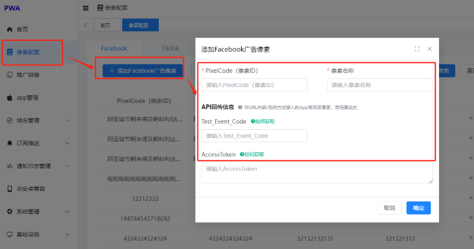 

3.1. How to obtain the PixelCode (Pixel ID)

[ Login to the management background https: / / adsmanager.facebook. The com / enter into the pixel creation interface. Enter the following options, respectively:](https://adsmanager.facebook.com/进入像素创建界面。分别进入如下选项：)

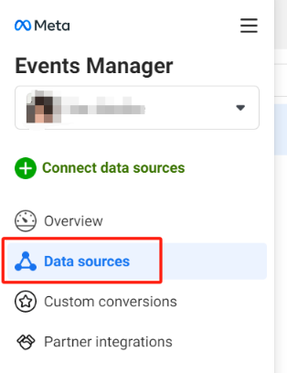 

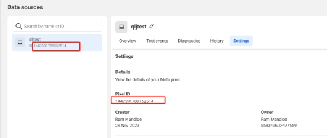 

As shown in the figure above, the Pixel ID is the required PixelCode (pixel ID).

If the form is empty and without any created PixelCode (pixel ID), you can go to the following menu to select the Web: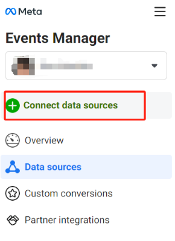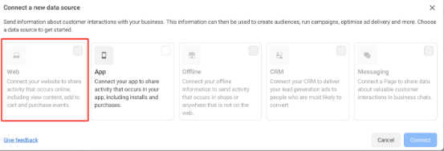

### How to get the Test_Event_Code

[ Login to the management background https: / / adsmanager.facebook. The com / enter into the pixel creation interface. Enter the following options, respectively:](https://adsmanager.facebook.com/进入像素创建界面。分别进入如下选项：)

 

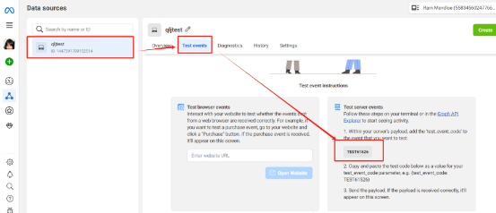As shown above, it is Test_Event_Code.

### How to obtain the AccessToken

[Login to the management background https: / / adsmanager.facebook. The com / enter into the pixel creation interface. Enter the following options, respectively:](https://adsmanager.facebook.com/进入像素创建界面。分别进入如下选项：)

 

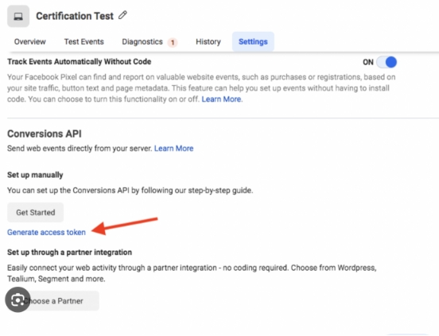 

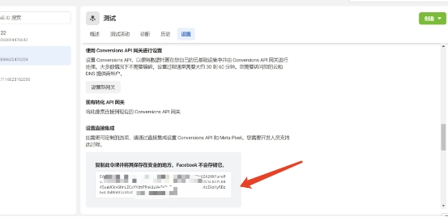 

As shown in the figure above is AccessToken, if there is no because there is no gateway set up, the gateway needs to be set before obtaining:

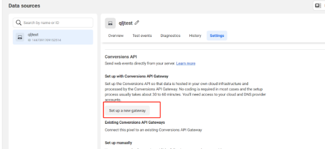 

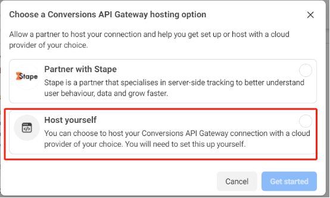 

**Facebook Advertising precautions**

Advertising is only for Andriod devices

At present, PWA is mainly aimed at the Android group. When conducting Facebook advertising, the audience group needs to only cover the Android terminal operation. The specific options are provided as follows:

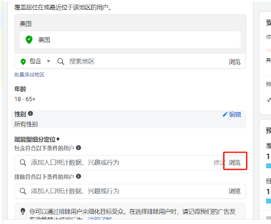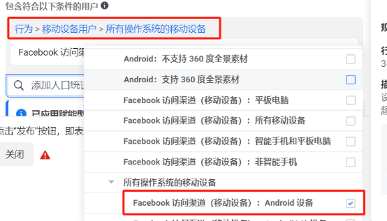 

 

 