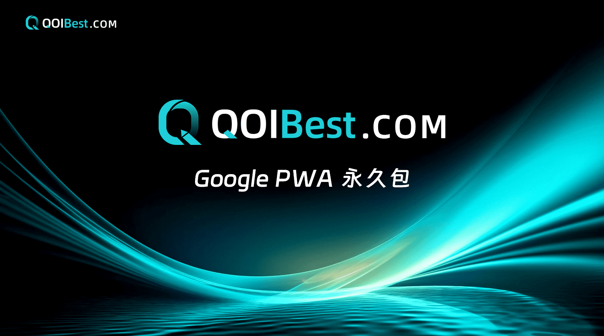

#  👋 Welcome to QOIBest PWA
**QOIBest PWA permanent package creator's only official website: https://qoibest.com/**

In the fast-paced world of digital marketing, efficiency and user experience are crucial. This is where QOIBest comes in and the cutting-edge solution for installation processes. QOIBest is built on Progressive Web Application (PWA) technology to provide seamless end-to-end solutions for advertisers and users;

PWA based access: QOIBest leverages the powerful features of PWA to provide an excellent application download experience on Android devices. With PWA, users can directly access and install applications from the browser without using traditional app stores;

## Thousands of paying users

QOIBest has thousands of satisfied paying users and a good record of success. Millions of applications are downloaded daily through our platform, demonstrating their effectiveness and popularity among users.

## Best PWA Experience

PWA is the pinnacle of Android application installation experience. QOIBest further enhances this excellence by providing the best PWA installation experience. Our platform not only fully utilizes the potential of PWA technology, but also enhances it through innovative features and seamless integration. PWA is the best Android application installation experience, and QOIBest is the best PWA installation experience.

## Expert development team

With the support of an experienced team of developers, QOIBest stands at the forefront of innovation. Our professional knowledge and dedication drive the continuous improvement and refinement of our products.

## Regular updates and optimizations

We are well aware of the importance of maintaining our position as pioneers. Therefore, QOIBest releases weekly updates and optimizations to maintain our competitive advantage. By maintaining agility and responsiveness, we ensure that our products continue to provide excellent results for our customers.

## No need for App Store list

One of the prominent features of PWA is its independence from traditional app stores such as Google Play. With QOIBest, users can enjoy the same seamless download experience without the hassle of listing on the app store. This freedom empowers developers and advertisers, while providing users with a worry free experience.

## Open ecosystem

The open ecosystem of PWA means that developers are not limited by the typical strict approval process of traditional app stores. With QOIBest, developers can confidently deploy their applications because they know they have complete control over the distribution process. In short, QOIBest is not just a solution; It is a game changer in the field of Android app advertising and installation. With its advanced PWA technology, expert development team, and commitment to continuous improvement, QOIBest has set standards for excellence in digital marketing. Join us and stay at the forefront of innovation, unleashing the full potential of your app advertising campaign through QOIBest.