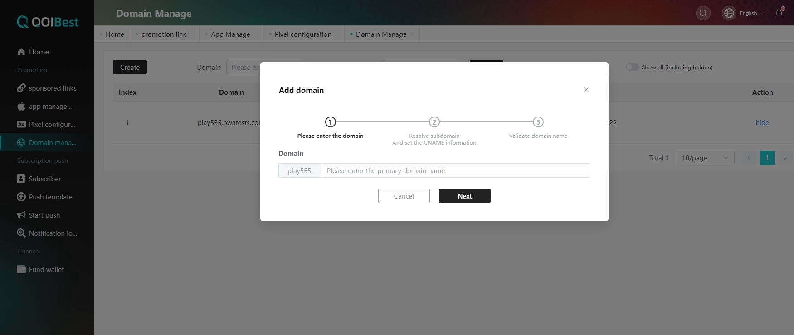
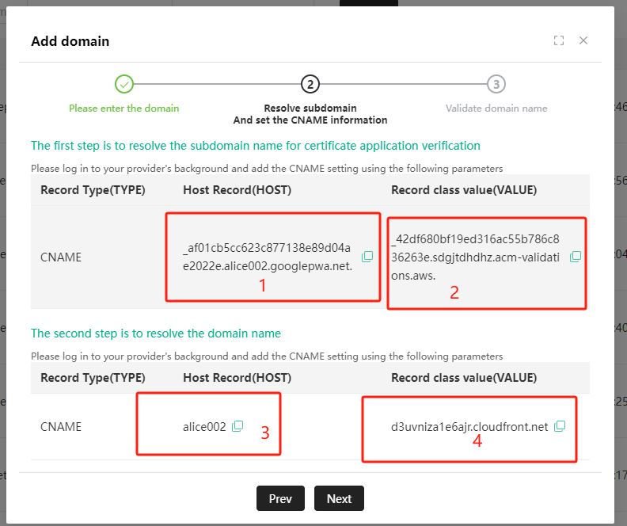
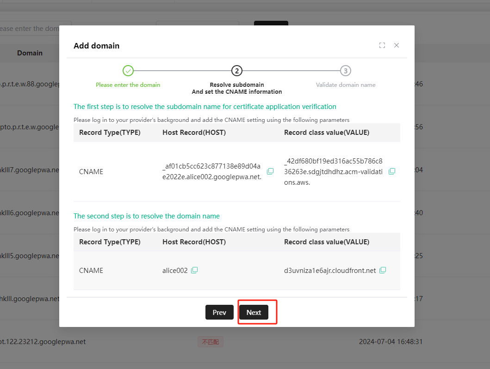
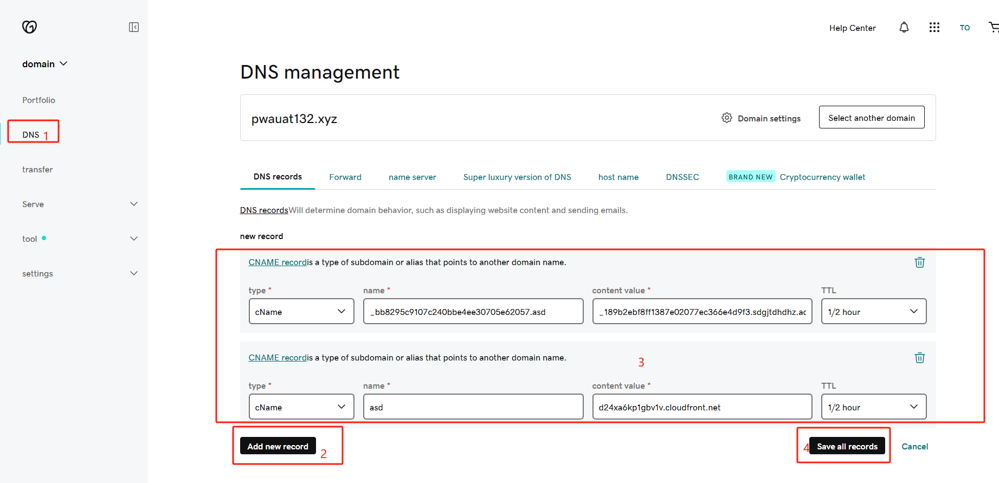
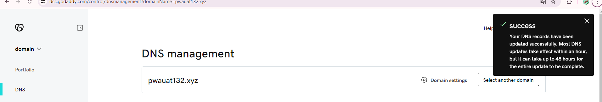
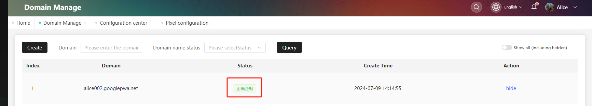
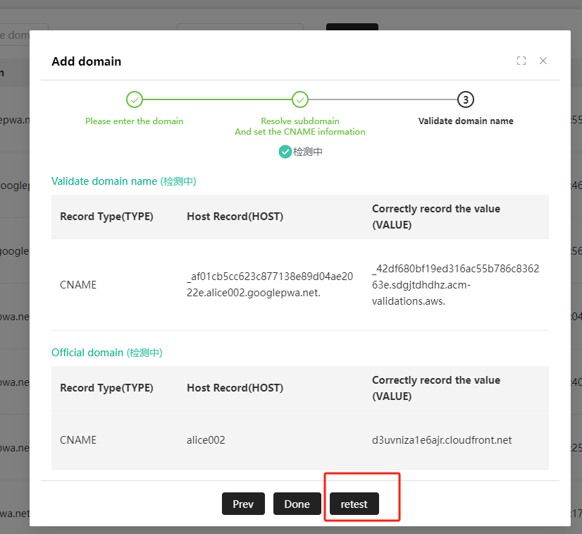

## Domain name management

In the promotion-domain name management, if there is no prefix, please go to the infrastructure-Configuration Center-domain name configuration to add the domain name prefix, as shown in the following figure,

 

After entering the main domain name, click Next

 

After parsing the subdomain name, login AWS background configuration of subdomain name and official domain name host and value, configuration as shown in the following figure,

 

After configuration is completed, click the domain name to verify the domain name (note: after AWS configuration is completed, the PWA system will automatically detect within 10min after adding the domain name submission)

 

 Login godaddy https://dcc.godaddy.com  backend to configure the host record and record class value, the operation is shown in the following figure.

Domain name was added successfully as shown in the following figure,
 

