# QOI_FAQS  

## Test_Event_Code获取 

Facebook 广告事件上报设置及投放指引

前言：此文档主要帮助您在PWA操作过程中需要做Facebook广告事件的上报指引以及投放注意事项。

一、PWA后台像素配置

目前PWA支持广告事件的上报，假设需要设置安装事件的上报的话需要先进入PWA后台【像素配置】菜单里面进行添加Facebook广告像素。其中会涉及到三个数值，即PixelCode、  Test_Event_Code、AccessToken。  

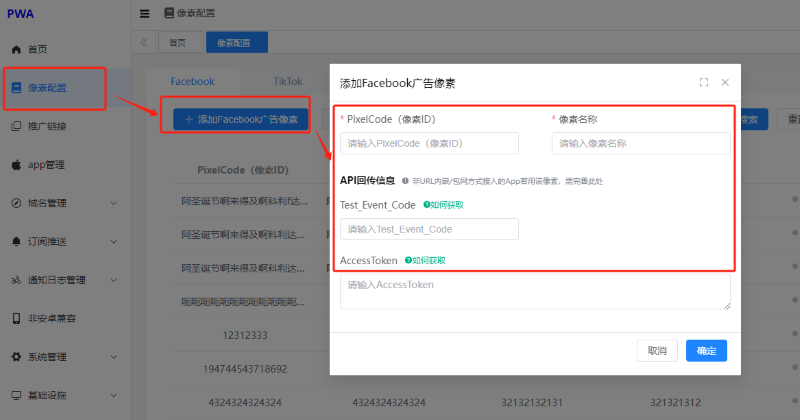 

### 如何获取PixelCode（像素ID）  

登录管理后台https://adsmanager.facebook.com/进入像素创建界面。分别进入如下选项：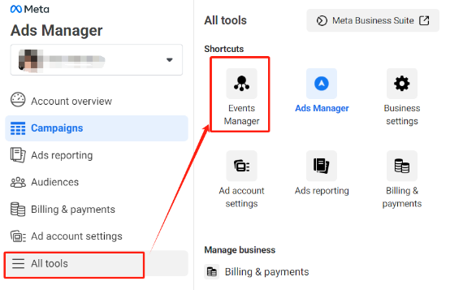

 

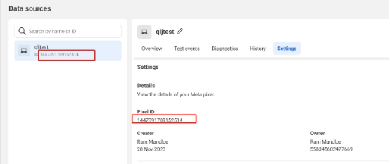 

如上图，Pixel ID即为所需要的PixelCode（像素ID）。

假设表单为空，无任何的已创建的PixelCode（像素ID）的话则可以进入如下菜单进行创建，创建的时候选择Web：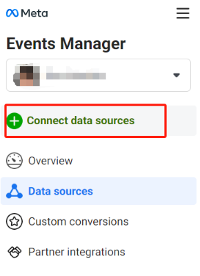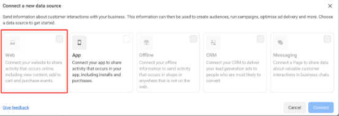

### 如何获取Test_Event_Code  

登录管理后台https://adsmanager.facebook.com/进入像素创建界面。分别进入如下选项：

 

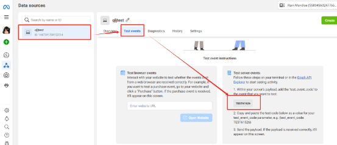如上图，即为Test_Event_Code。

### 如何获取AccessToken  

登录管理后台https://adsmanager.facebook.com/进入像素创建界面。分别进入如下选项：

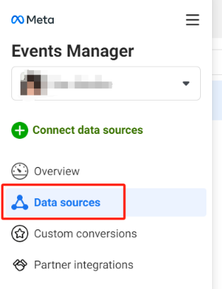 

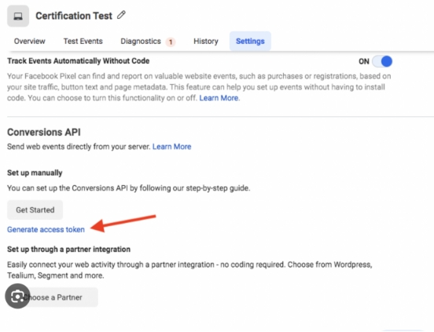 

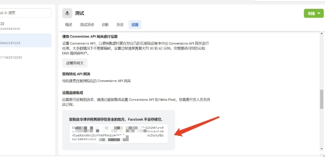 

如上图即为AccessToken，假设没有的话则是因为无设置网关，则需要先进行网关的设置后再获取：

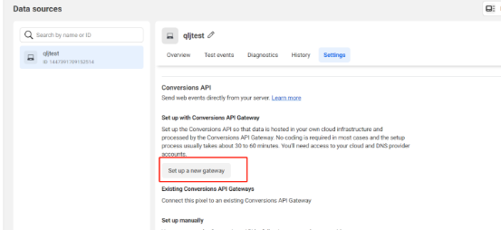 

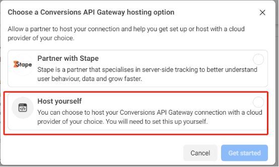 

Facebook广告投放注意事项  

1. 投放广告仅针对Andriod设备
2. PWA目前主要针对的为安卓群体，进行Facebook广告投放的时候受众群体需要进行只覆盖安卓端的操作。具体选项如下：

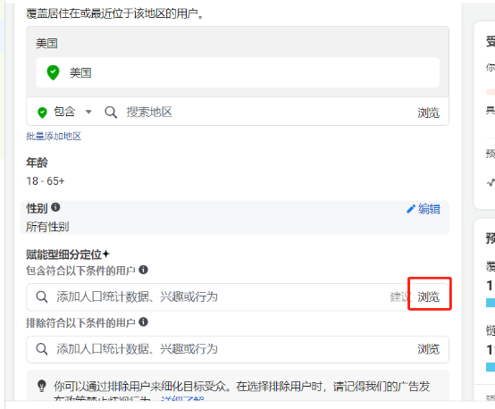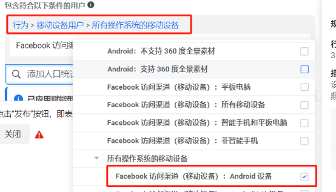 

 