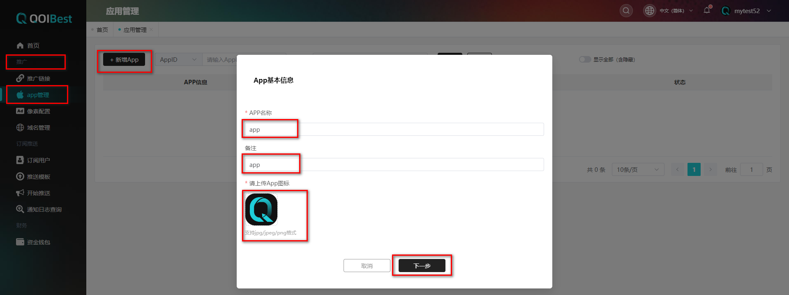
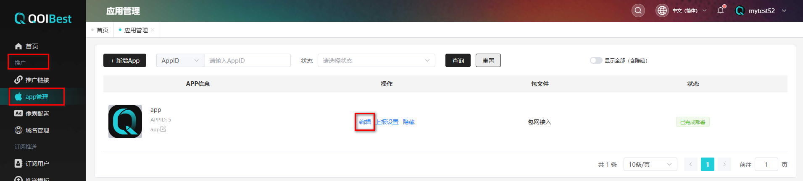
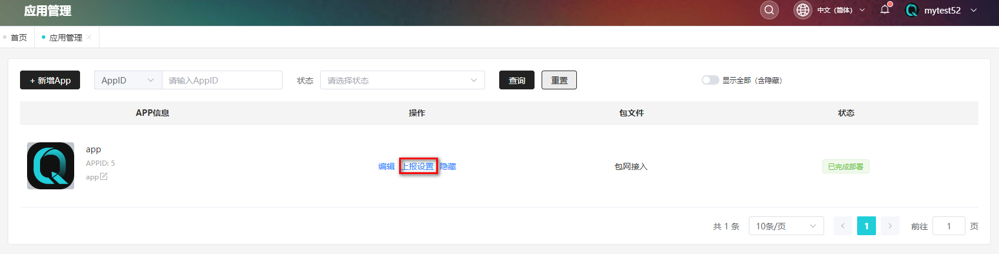
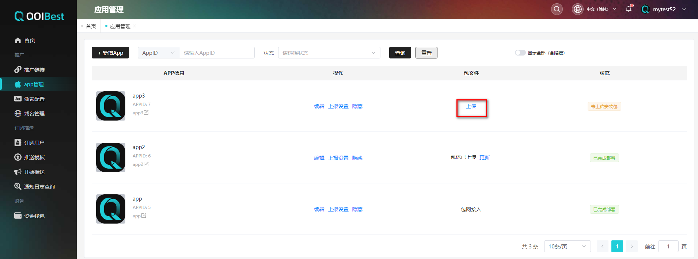
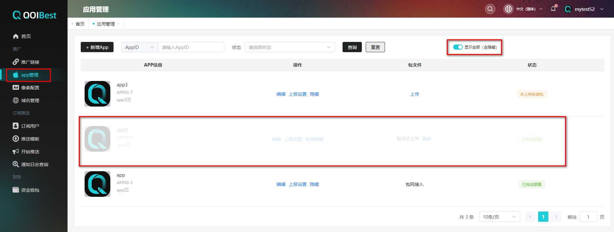

## APP管理 

### 新增APP  

 APP相关的信息设置，主要展示在用户桌面或者是商店页； 

(1) 在**【推广】**的**【app管理】**点击**【+新增App】**,配置APP的基本信息填写APP名称(必填),上传App图示(必填,支持png/jpg/peg/gif格式的图片),

 

(2) 配置APP商店信息,包括语言信息,商店中APP名称/APP图示/APP下载数/APP年龄限制/APP评论数,APP简介/APP的详情图(5张详情图片),APP标签(10个标签),APP得分/APP评论区设置(评论者头像/评论者名称/评论者分数/评论内容)

(3) 商店信息**【添加多语言】**

 在商店信息添加多语言,默认英语,可添加其他语言(德语/韩语/日语/孟加拉语等)

  

(4) 配置好多语言后,填写商店的APP名称(必填),APP图示(必填),APP下载数(必填),APP年龄限制(必填),APP评论数(必填),如下图所示,

 

(5) 配置商店APP详情图/APP标签/评分/评论区(评论者姓名/头像/评论内容必填),如下图所示,

 

注：

①此页信息内容编辑影响APP桌面图标的展示样式，APP名称及APP图标会对外展示，备注主要方便客户管理，用户无法查看；

②APP图标没有固定尺寸要求，1:1即可（部分安卓设备桌面图标会自动缩放，建议元素居中设置，四周可以适当留白边）；

(6) 其他设置,配置APP启动时的主题颜色/背景颜色/默认荧幕方向/是否全面显示/是否预加载,如下图所示,
 

(7) 上报设置,**【是否开启首次行为上报】**,**【归因上报到哪里】**,上报窗口期,如下图所示,

 

(8) 上传包体,选择**【应用包体(ZIP安装包)】**,上传ZIP压缩包和打包域名,点击**【保存】**

 

打包格式：

 

发布后,等待部署完成,完成后状态为**【已完成】**部署,如下图所示,

 

**【包网接入】**,选择打包域名,如下图

 

 

### 编辑APP  

(1) 在APP管理列表,选择要编辑的APP应用,点击**【编辑】**按钮,可编辑APP的基本信息/商店信息/其他设置/上报设置信息等,如下图所示,

 

 

 

 

### APP上报设置  

在APP应用列表点击**【上报设置】**,如下图,

 

更新上报设置的是否开启首次上报/归因上报到哪里/上报窗口期,如下图所示,

 

### APP包文件上传  

在APP管理列表点击包文件列**【上传】**按钮,可上传包档和打包域名,如下图所示,

 

 

 

 

 

### APP包文件更新  

在APP应用列表包体已上传,点击**【更新】**按钮,上传包体选择上传新的包体保存,如下图所示,

 

 

### APP应用隐藏/显示全部  

在APP应用列表选择要隐藏的APP,点击**【隐藏】**,如下图所示,

 

 

显示全部(含隐藏),如下图,

 

 

