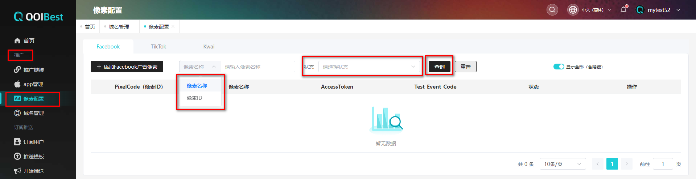
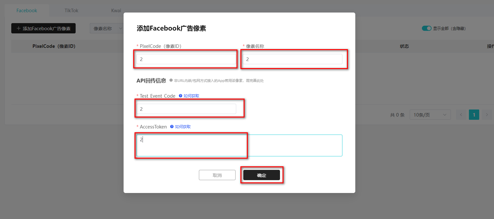
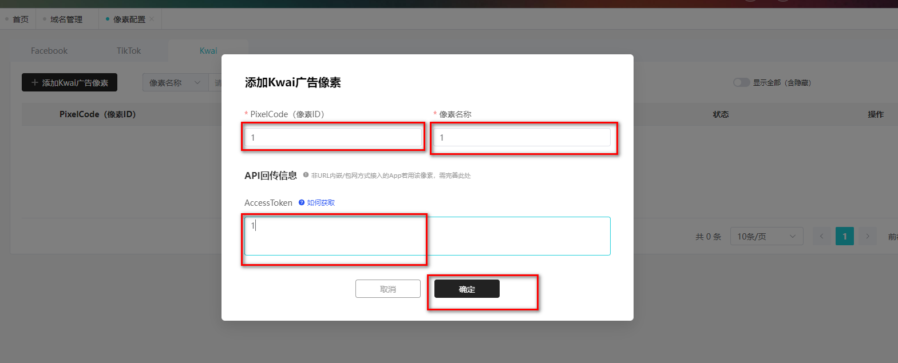
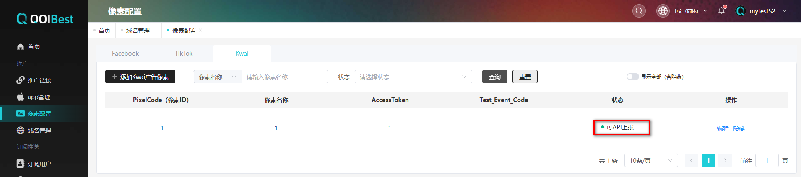

# 推广管理  

## 像素配置

像素配置主要用于广告事件回传/上报，目前QOIBest 平台仅回传“安装”事件，其他事件通过参数回传，请前往广告或者网站后台查询

### 添加facebook像素  

在**【推广】**的**【像素配置】**可根据像素ID/像素名称/状态查询facebook广告像素,如下图所示

 

在**【推广】**的**【像素配置】** ,点击**【添加Facebook广告像素】**,添加像素ID/像素名称/Test_Event_Code/AccessToken,像素ID/Test_Event_Code/AccessToken获取可参考文档**【如何获取】**,如下图所示

 

对照Facebook广告后台，填写广告像素信息，点击**【确定】**；

如何获取Test_Event_Code/AccessToken,参考以下链接

https://qoibest.com/document/facebook

注：标*为必填字段；Test_Event_Code、Access Token 如填写其中一项，另一项为必填；

调用QOIBest API接口用户须填写Test_Event_Code、Access Token ；无须调用则可不填写；

|         字段         |           字段解析           |
| :------------------: | :--------------------------: |
| Pixel Code（像素ID） | 同Facebook 后台Pixel Code；  |
|       像素名称       |   按需设置，方便管理即可；   |
|   Test_Event_Code    | 用于激活像素时回传相关事件； |
|     Access Token     |   Facebook 后台访问口令；    |

### 添加TikTok广告像素  

与Facebook操作相同,如下图,添加PixelCode(像素ID)/像素名称/AccessToken/Test_Event_code

 

 

 

### 添加Kwai广告像素

**【添加Kwai广告像素】**添加PixelCode/像素名称/AccessToken,如下图所示

 

添加成功如下图所示

 

 

 

 

 