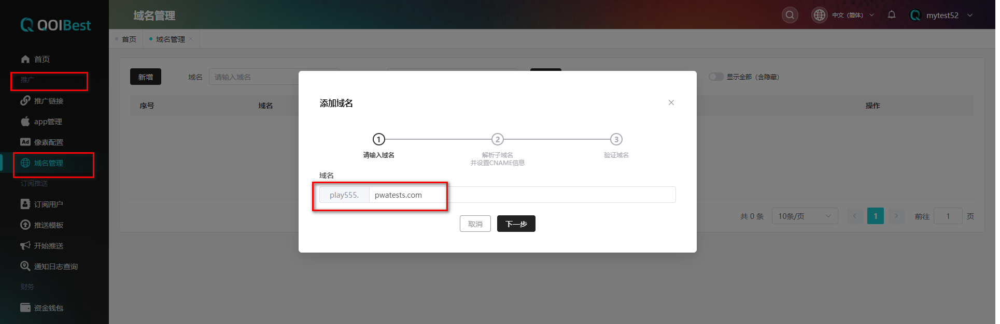
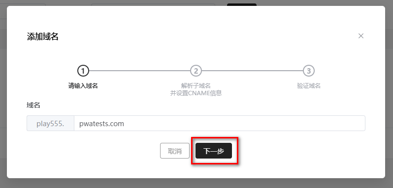
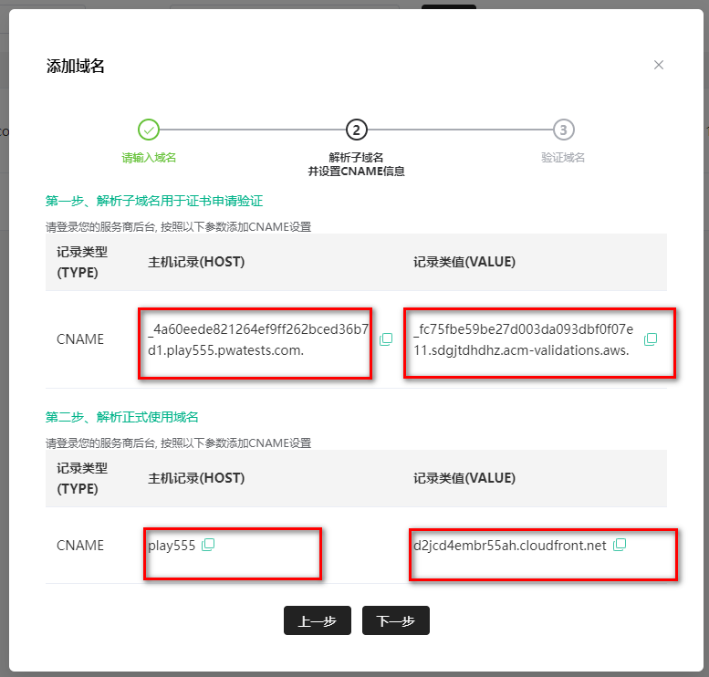
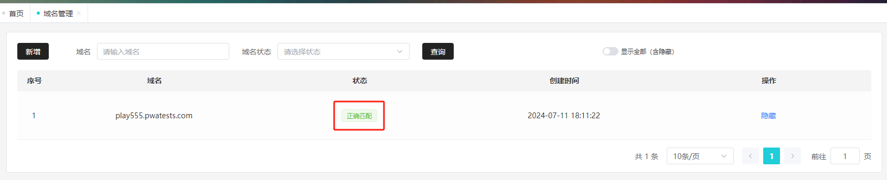

## 域名管理

在**【推广】**的域名管理的**【新增】**,若没有前缀可咨询系统管理员,如下图所示,

新增域名输入主域名后,点击**【下一步】**

 

分别复制以下主机记录（HOST）、记录类值（VALUE），填入域名运营商后台并操作解析，解析成功后点击页面**【下一步】**；

 

域名添加成功如下图所示，点击**【完成】**即可完成域名配置； 

页面显示**【未收到解析】**请检查域名是否解析成功，一般与域名解析时效（10min-24h不等）或地区有关，具体可咨询域名运营商；建议等待10min后点击**【重新检测】**；系统后台也会对域名进行自动检查，若检测成功则会通过站内消息提示。

 

域名解析成功显示如下：

