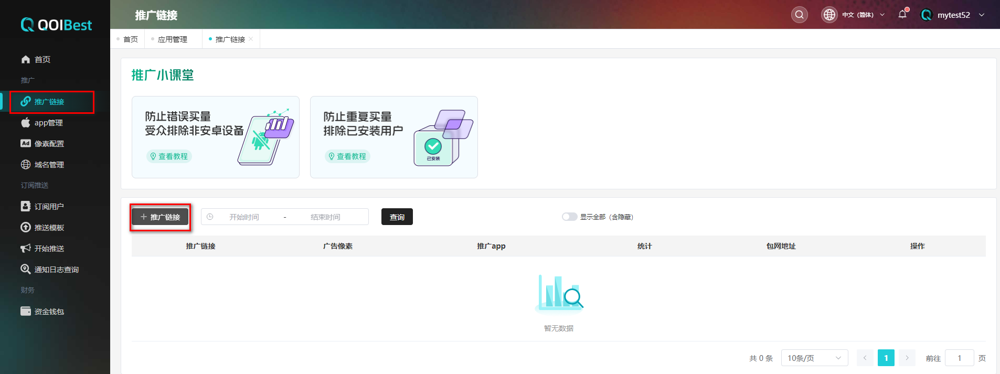
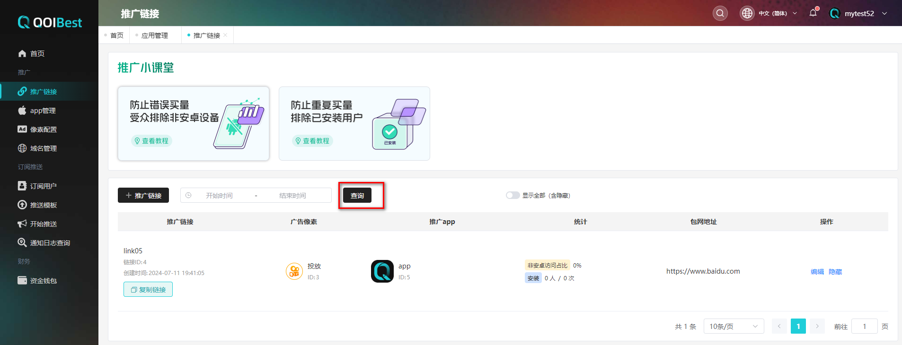
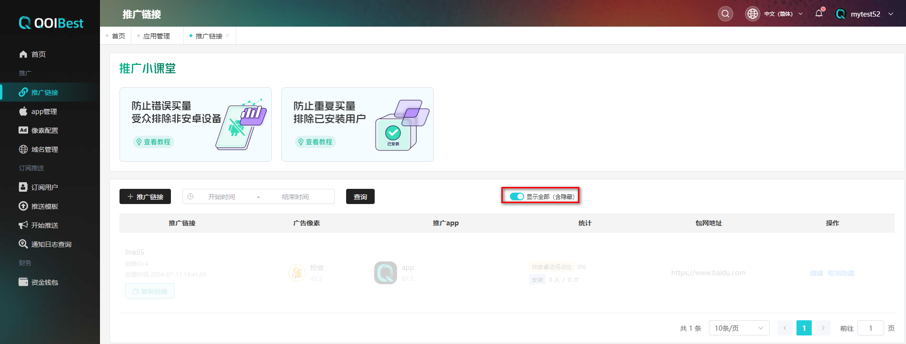

##   推广链接  

 广告平台的投放链接 

### 新增推广链接  

在 **【推广】**的**【推广链接】**,点击**【推广链接】** 新增推广链接,如下图所示,

 

新增推广链接,选择推广**【app】**,填写**【链接名称】**,**【投放平台】**(Facebook/Kwai/TikTok),选择对应平台要使用的**【广告像素】**,选择**【落地页使用的域名】**,如下图所示,

 

推广链接新增成功后**【复制链接】**投放在社交媒体上,

 

注：

①如选择需要推广的APP是包网接入方式，需要填写带像素的包网地址（一般从广告媒体侧拿到像素之后，发给包网平台，会协助生成包网地址）；

②IOS跳转链接指IOS设备访问时，可以自定义跳转的页面，但IOS没留存，建议广告投放时只选择投放安卓设备；

### 编辑推广链接  

在推广链接列表可**【编辑】**链接名称/广告像素,如下图所示,

 

### 推广链接查询  

推广链接列表可根据时间,今天/昨天/最近七天/最近30天/本月/今年查询推广链接,如下图所示,

 

### 推广链接隐藏/显示全部  

推广列表点击**【隐藏】**按钮,如下图所示,
 
 

显示全部,打开**【显示全部】**按钮(含隐藏),将显示所有推广链接,如下图所示,
 
