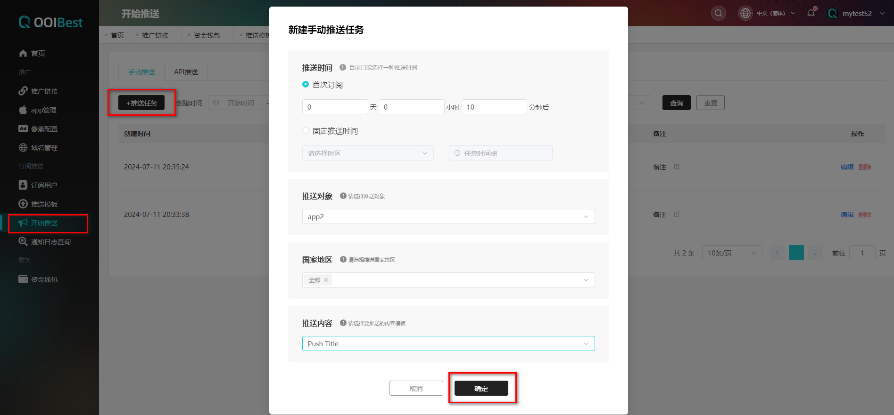
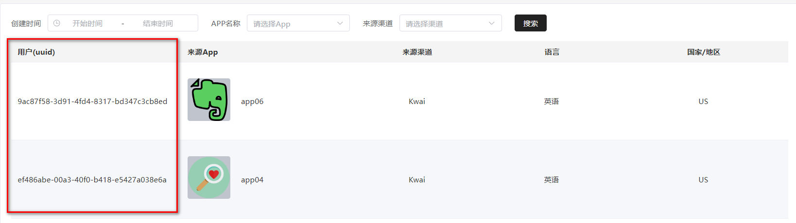
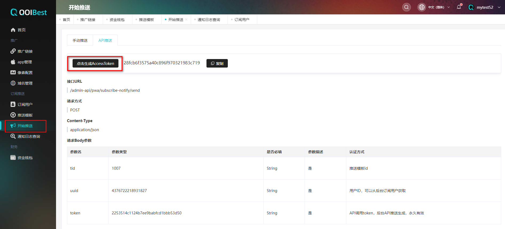

# 开始推送

## 手动推送

**前置条件：**

①有可用的推广链接

②有可用的推送模板

**推送时间的两种选择**

首次订阅：【条件：需要在客户安装之前进行创建该任务】设置10分钟，客户安装完在10分钟后将会收到推送信息

 

固定推送时间：设置北京(UTC+8)  2024-06-30 12:00:00时间，安装的客户将会在这个指定时间收到推送信息

 

**步骤：**

①进入订阅推送 -开始推送的**【手动推送】**列表

②点击**【推送任务】**

③填写信息

 

## API推送

**如何获取uuid**

在**【推送管理】**的**【订阅用户】**，在列表中找到**【用户(uuid)】**标签处查找对应用户的UUID；

#### 如何获取token

选择【开始推送】，【API推送】，【点击生成Access Token】；

 