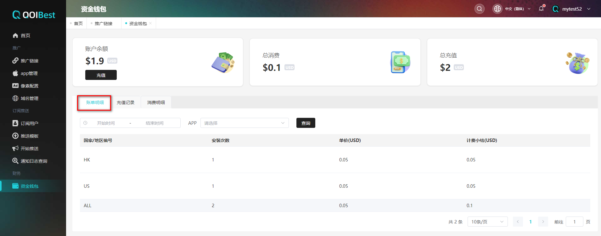
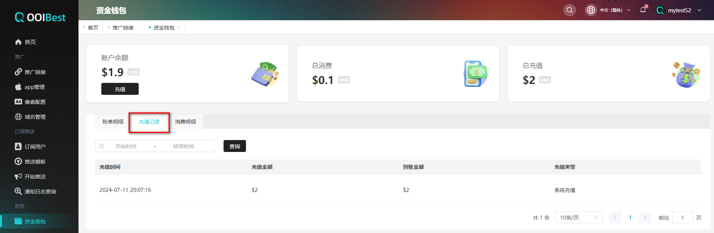
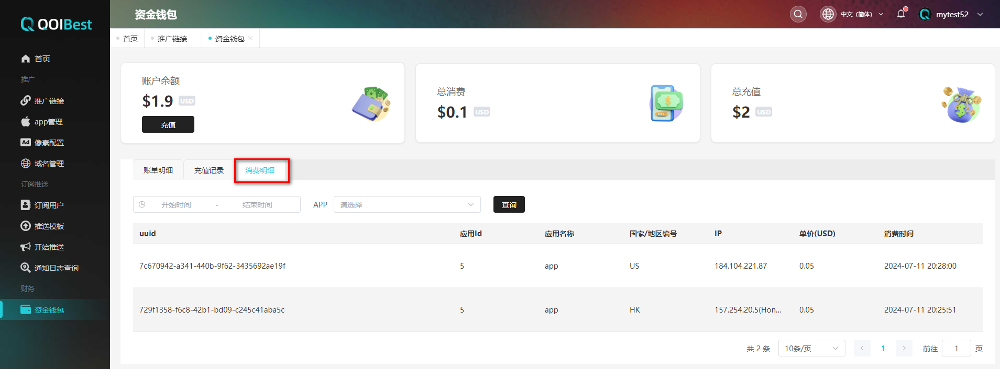

# 资金钱包

会展示该用户的**【账户余额】**、**【总消费】**、**【总充值】**，以及三个列表：**【账单明细】**、**【充值记录】**、**【消费明细】**

## 相关信息介绍：

账单详细：每个应用安装一次，该列表会展示安装时用户的IP地址、该app安装的次数、安装的单价和安装的总费用，会进行汇总；同一个app的安装信息展示在一起

【注意：用户第一次安装app时，才会进行扣费；当用户卸载后再次安装该app，不会进行扣费】

 

## 充值记录

 

## 消费明细

每个应用安装一次，该列表会展示安装的AppId、用户的IP地址、该app安装的次数、安装的单价和安装的总费用（没有进行汇总）

 